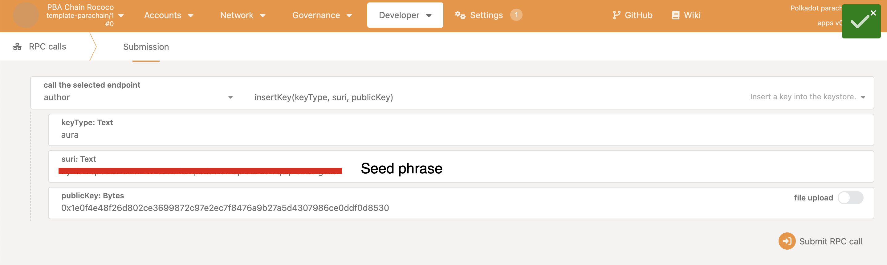

# Collator Setup

A collator is a node that collates the transactions on the parachain network into blocks and sends them for validation to the relay chain network. Hence, parachain transactions achieve finality when the parablock is validated, and their Proof of Validity is finalized on the relay chain. Hence, the security assumptions of the collator node are minimal as the transaction validity checks happen on the relay chain. A parachain can work fine with a single or small collator set. If you plan to decentralize the parachain network, the network needs just one honest collator to avoid the problem of transaction censorship.

Typically, a large decentralized parachain network would have a large set of collators, dedicated parachain nodes (often acting as bootnodes), and a set of RPC nodes *separately*.

> **For testing, it is possible to allow for a single collator to provide RPC capabilities. In production, setting up your collators and RPCs on separate machines with proper load balancing and security is recommended.**

If you wish to connect an RPC Node through its IP address, then the [Substrate frontend template](https://github.com/substrate-developer-hub/substrate-front-end-template) can be used, as it allows for insecure WebSocket connections. For using Polkadot JS UI to access an RPC node on a remote machine, you will need a [secure WebSocket connection](#setting-up-ssl-and-nginx-proxy). For an RPC node instance a local machine, both UIs work seamlessly. 

## The Collator Selection Pallet

Assuming you plan on using the [`collator-selection`](https://paritytech.github.io/polkadot-sdk/master/pallet_collator_selection/index.html) pallet (which is typically the default in most of the templates, and it is also what Educhain uses), there are two terms you need to be familiar with: 

- **Candidates** - Accounts that have registered for becoming collators typically by bonding a deposit. These accounts receive authorization to collate if they meet the requirements set by the network. This ensures a permissionless way of registering to becoming a collator.
- **Invulnerables** - Accounts that are *guaranteed* to participate in block production, irrespective of the bonding requirements. If the collator selection mechanism is Aura, they will participate in block production round-robin style.

Candidates can add or remove themselves from collation on a live network. **Invulnerables**, however, can only be added or removed through an account with sudo or root privileges. They are also usually specified in the chain spec as the "bootnodes".  It is wise to add at least one collator in your chain_spec - and one that you can start easily. That way you can always gurantee a collator that can produce blocks.

## Node Roles & Resources

For simplicity, EduChain runs a single node with multiple roles (as an RPC node *and* collator). However, for robustness, it is recommended that you split the network operations into several instances of nodes, i.e., a separate VPS/instance for an RPC and collator node.

For more information and details about different roles, refer to the [Parity DevOps Guide.](https://paritytech.github.io/devops-guide/deployments/roles.html)

## Setting up collators in the chain spec

If you are using the parachain template, you can configure a [patch file](https://github.com/w3f/educhain/blob/main/educhain.patch.json) to generate a chain specification, wherein you can setup:

- The initial *public* session key(s).
- The collator(s) public keys which are used for setting its identity and a destination for rewards (if any).

As an example, EduChain sets **two** initial collator and session public keys for Aura, allowing the chain to hit the ground running with two collators which are not running with Bob or Alice keys:

```json
// Collator accounts that produce blocks and earn rewards.
"collatorSelection": {
    "candidacyBond": 16000000000,
    "invulnerables": [
    "5DLxwPqG2EsY93P6ii3LY1nsT59kSccZK7LJN7Vsv6DGt6Tg",
    "5DAPBz3PHJnVDFmLs67TL91NxCWZ6yyUBddgBGQgFYYxpGBi"
    ]
},

// Note: The private key of these session keys needs to be inserted into the collator node for it to start producing blocks.
"session": {
    "keys": [
    [
        "5DLxwPqG2EsY93P6ii3LY1nsT59kSccZK7LJN7Vsv6DGt6Tg",
        "5DLxwPqG2EsY93P6ii3LY1nsT59kSccZK7LJN7Vsv6DGt6Tg",
        {
        "aura": "5Ck7qhcDuEScRc4Sg1MXYkA8HW8cx8EdaxoW7cva5sGrTWQZ"
        }
    ],
    [
        "5DAPBz3PHJnVDFmLs67TL91NxCWZ6yyUBddgBGQgFYYxpGBi",
        "5DAPBz3PHJnVDFmLs67TL91NxCWZ6yyUBddgBGQgFYYxpGBi",
        {
        "aura": "5CkZxLvH2UjBtWLoddGaavPVAv88o1Cww1aWa8UPz9Sw4iyv"
        }
    ]
    ]
},
```

You may notice that the collator and aura/session keys are different. For security reasons, the collator key should be stored in a secure location, i.e., a hardware wallet. The session key can change, and is effectively linked to the invulnerable key.

You can then use this patch file with `chain-spec-builder` and the Wasm runtime to generate the chain specification, [as shown here.](https://wiki.polkadot.network/docs/build-guides-template-basic#generating-the-chain-specification)

For an explanation on the types of keys, their specific types, and how to generate them, refer to the [Parity DevOps documentation.](https://paritytech.github.io/devops-guide/explanations/keys_accounts.html)

## Configuring and running your collator

To run a collator, one needs to make sure that:

- The node is synced with the relay chain (a local copy is needed, pruning is *highly* recommended)
- The corresponding private key of the session key (for aura) in the chain spec is inserted, either through rpc or through the [polkadot-parachain](https://github.com/paritytech/polkadot-sdk/tree/master/cumulus/polkadot-parachain) `key insert` command
- To receive collator rewards, the session key and invulnerable address need to be linked. Otherwise, it will default to the first invulnerable in the configuration

> **Note**: that it is recommended to insert the keys locally in your node, as RPC methods should not be exposed for external calls. In order for the below to work, `--rpc-methods` must be set to `unsafe`, or not set at all.



Alternatively, with [`polkadot-parachain`, as seen in the Parity DevOps handbook.](https://paritytech.github.io/devops-guide/explanations/keys_accounts.html#insert-a-specific-key-onto-a-node-keystore-using-the-node-binary)

### Running the collator

Once your session keys are properly inserted, you can run your collator.

This sample command runs a collator using the [`polkadot-parachain` (or "omninode")](https://github.com/paritytech/polkadot-sdk/tree/master/cumulus/polkadot-parachain) binary:

```sh
polkadot-parachain --name COLLATOR_NAME \
--collator \
--chain plain-parachain-chainspec.json \
--base-path ./educhain \
--rpc-cors=all \
--rpc-methods=safe \
--port 30333 \
--rpc-port 8844 \
-- \
--chain paseo \
--sync warp \
--blocks-pruning 256
--state-pruning 256
```

> Note that a few of the arguments, such as `--name`, `--chain`, `--base-path` should be substituted with your own collator name, chain spec, and base path accordingly.

Once your collator has synced with its respective relay-chain, and as long as you have coretime (either bulk or on-demand are suitable) then your collator should be capable of blocks.

For a bootnode, it may help to generate a static network key, [see this guide for more details.](https://paritytech.github.io/devops-guide/guides/parachain_deployment.html#generate-parachain-private-keys)

### Changing / rotating session keys

Because the genesis already sets the keys for the invulnerable and session keys, we do not need to call `session.setKeys` explicitly. As long as the correct session keys in the genesis are inserted for the collator, then it will use that account for rewards and block production.

However, if wish rotate keys, then we need to ensure that the mapping is properly updated:

- Calling `author.rotateKeys()` and copying the public key
- Setting the new key via ``

### `systemd` and Collators

Once you've achieved a stable setup, you can look into automating the launch of your collator upon startup. Here is an example of a service which automatically starts a shell script using `systemd` on Ubuntu Linux:

- `start.node.sh`:
```sh
polkadot-parachain --name C2_EDU \
--collator \
--chain plain-parachain-chainspec.json \
--base-path ./educhain \
--rpc-cors=all \
--rpc-methods=safe \
--port 30333 \
--rpc-port 8844 \
-- \
--chain paseo \
--sync warp \
--blocks-pruning 256
--state-pruning 256
```

> Note that `--rpc-methods=safe` disables certain RPC calls from the outside world.  If you wish to call these unsafe calls externally, you may remove `--rpc-methods=safe`.  It is prudent that for production environments, you ensure that no one can access these crucial calls (i.e., setting the keys in your node).

- `collator.service`:
```ini
[Unit]
Description=Collator for EduChain
After=network.target

[Service]
Type=simple
User=root
WorkingDirectory=/root
ExecStart=/bin/sh start.node.sh
Restart=on-failure

[Install]
WantedBy=multi-user.target
```

This way, now we can manage our elegantly collator with `systemctl`:

- `systemctl restart collator ` - Restarts the collator
- `systemctl stop collator ` - Stops the collator
- `systemctl start collator ` - Starts the collator
- `systemctl status collator ` - Retrieves and displays the status of the collator
  
Here is an example of how a functioning collator looks in action, via the status command: 

```sh
root@ubuntu-s-2vcpu-4gb-amd-nyc3-01:~# systemctl status collator
● collator.service - Collator for EduChain
     Loaded: loaded (/usr/lib/systemd/system/collator.service; disabled; preset: enabled)
     Active: active (running) since Wed 2024-06-05 18:02:23 UTC; 5 days ago
   Main PID: 132465 (sh)
      Tasks: 46 (limit: 4658)
     Memory: 2.1G (peak: 2.5G)
        CPU: 8h 23min 34.532s
     CGroup: /system.slice/collator.service
             ├─132465 /bin/sh start.node.sh
             └─132466 polkadot-parachain --name C2_EDU --collator --chain plain-parachain-chainspec.json --base-path ./educhain --rpc-cors=all>

Jun 10 20:48:00 ubuntu-s-2vcpu-4gb-amd-nyc3-01 sh[132466]: 2024-06-10 20:48:00 [Relaychain] ♻️  Reorg on #10834776,0xf566…ab31 to #10834776,0x1>
Jun 10 20:48:00 ubuntu-s-2vcpu-4gb-amd-nyc3-01 sh[132466]: 2024-06-10 20:48:00 [Relaychain] ✨ Imported #10834776 (0x1583…c83f)
Jun 10 20:48:05 ubuntu-s-2vcpu-4gb-amd-nyc3-01 sh[132466]: 2024-06-10 20:48:05 [Parachain] 💤 Idle (0 peers), best: #153 (0x998c…e0d8), finali>
Jun 10 20:48:05 ubuntu-s-2vcpu-4gb-amd-nyc3-01 sh[132466]: 2024-06-10 20:48:05 [Relaychain] 💤 Idle (15 peers), best: #10834776 (0x1583…c83f),>
Jun 10 20:48:06 ubuntu-s-2vcpu-4gb-amd-nyc3-01 sh[132466]: 2024-06-10 20:48:06 [Relaychain] ✨ Imported #10834777 (0x705d…63cb)
Jun 10 20:48:10 ubuntu-s-2vcpu-4gb-amd-nyc3-01 sh[132466]: 2024-06-10 20:48:10 [Parachain] 💤 Idle (0 peers), best: #153 (0x998c…e0d8), finali>
Jun 10 20:48:10 ubuntu-s-2vcpu-4gb-amd-nyc3-01 sh[132466]: 2024-06-10 20:48:10 [Relaychain] 💤 Idle (15 peers), best: #10834777 (0x705d…63cb),>
Jun 10 20:48:12 ubuntu-s-2vcpu-4gb-amd-nyc3-01 sh[132466]: 2024-06-10 20:48:12 [Relaychain] ✨ Imported #10834778 (0x7a52…93f6)
Jun 10 20:48:15 ubuntu-s-2vcpu-4gb-amd-nyc3-01 sh[132466]: 2024-06-10 20:48:15 [Parachain] 💤 Idle (0 peers), best: #153 (0x998c…e0d8), finali>
Jun 10 20:48:15 ubuntu-s-2vcpu-4gb-amd-nyc3-01 sh[132466]: 2024-06-10 20:48:15 [Relaychain] 💤 Idle (15 peers), best: #10834778 (0x7a52…93f6),>
```

## Setting up SSL and nginx proxy

This doesn't aim to be an exhaustive devops guide on nginx ([for that, you can refer here](https://paritytech.github.io/devops-guide/overview.html)).  You should have the following already obtained:

- A domain
- `nginx` installed
- A free SSL certificate via [Lets Encrypt](https://letsencrypt.org/) via `certbot`

Once that is in place, navigate to your site's nginx config, and go to the server block with Certbot's SSL settings, and paste the following:

```nginx
location / {
    proxy_buffers 16 4k;
    proxy_buffer_size 2k;
    proxy_pass http://localhost:8844;
    proxy_http_version 1.1;
    proxy_set_header Upgrade $http_upgrade;
    proxy_set_header Connection "Upgrade";
    proxy_set_header Host $host;
}
```

> **Please note that the URL "http://localhost:8844"'s port must match your running collator.**

```nginx
server {
        server_name rpc.web3educhain.xyz www.rpc.web3educhain.xyz;
        location / {
            proxy_buffers 16 4k;
            proxy_buffer_size 2k;
            proxy_pass http://localhost:8844;
            proxy_http_version 1.1;
            proxy_set_header Upgrade $http_upgrade;
            proxy_set_header Connection "Upgrade";
            proxy_set_header Host $host;
        }
    listen 443 ssl; # managed by Certbot
    # other SSL info here...
}
```

Once this is in place, restart nginx, and you can access the node via port `443`.
