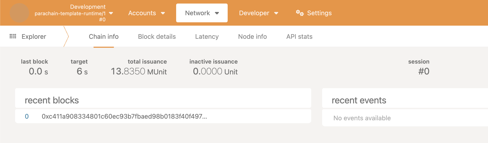

# Sub0 Reset 2024 Workshop

## Launch your Appchain to Production

The journey of any production-grade application starts on a test network. Polkadot's [Paseo Network](https://github.com/paseo-network) mirrors Polkadot and its system chain runtimes, making it the ideal playground for testing appchains.

## Audience

This workshop is for anyone who wants to understand the process of launching their own chain on Polkadot and leveraging system chain integrations.

**Prerequisites:**
*   Familiarity with Polkadot JS UI.
*   Substrate runtime development experience.
*   Experience with [minimal](https://github.com/paritytech/polkadot-sdk-minimal-template) or [solochain](https://github.com/paritytech/polkadot-sdk-solochain-template) templates.

!!! tip "Stuck?"
    If you get overwhelmed, you can find the complete code for this workshop [here](https://github.com/DrW3RK/polkadot-sdk-parachain-template/commit/7be19b80afa5c5df8c284f02ca50e22b76088510).

## Workshop Tasks

### Phase 1: Preparation (Before Workshop)

- **(Easy)** [Register a ParaID](#register-a-paraid) on Paseo Network.
- **(Easy)** Build the [parachain template](#build-parachain-template).
- **(Intermediate)** Build [Chainspec](#chain-spec-with-genesis-state-and-wasm) with custom collator keys.
- **(Easy)** Register genesis state and wasm blob of the parachain.
- **(Easy)** Run collator nodes and set collator keys.

### Phase 2: Live Action (During Workshop)

**After onboarding:**

- **(Easy)** Produce the first parachain block on-demand.

**System Chain Integrations:**

- **(Intermediate)** [Establish a communication channel](#establish-hrmp-channel-with-asset-hub) with Paseo Asset Hub.
- **(Intermediate)** Register the parachain native token as a foreign asset on Paseo Asset Hub.

### Phase 3: Next Steps (After Workshop)

- **(Intermediate)** Add a new pallet to the parachain runtime.
- **(Advanced)** Perform a runtime upgrade.

### Register a ParaID

- If you have not already, Create an account using any of the awesome [Polkadot wallets](https://polkadot.com/get-started/wallets) for browsers.
- Get the PAS tokens from the [Polkadot Faucet](https://faucet.polkadot.io/).
- Navigate to [Parachains tab on Polkadot JS UI](https://polkadot.js.org/apps/?rpc=wss%3A%2F%2Fpaseo.rpc.amforc.com#/parachains/parathreads) on Paseo Network and click on ParaID and do the needful to register a unique `ParaID`

### Build Parachain Template

- Setup the [Polkadot Parachain template](https://github.com/paritytech/polkadot-sdk-parachain-template) repository
- Follow the installation instructions and build the parachain template
- Explore all the commands available `./target/release/educhain-node --help`
- Start the parachain node locally with `./target/release/educhain-node --dev` and connect to it at the endpoint `ws://127.0.0.1:9944` using Polkadot JS UI. No blocks are produced in this mode.



### Chain Spec with Genesis State and Wasm

The Genesis state paired with Wasm (State Transition function) contains all the info that is needed for a node to start producing blocks. It includes the information that uniquely identifies the Parachain (ParaID), relay chain, collator keys etc.

Although, dev keys like Alice, Bob etc. help with tinkering with the node, it is important to remove them and work with the keys generated
by you. The genesis state can be used include accounts with pre-minted balance, accounts with root (sudo) privileges, collator identity
and session keys etc. In case of chain migrations, the genesis could be the snapshot of the entire chain state. 

For the workshop you can work on

- Adding an account or multiple accounts with funds
- Adding at least one account with root privileges to issue sudo calls
- [Adding at least one pair of collator keys (identity and session)](collator.md#setting-up-collators-in-the-chain-spec)

Do not make the mistake of reusing the collator identity keys for session keys. The session keys are placed on a hot wallet and are 
[rotated often](collator.md#changing--rotating-session-keys). The collator identity key remains the same. That key is the identifier for 
the node that produces a block. 

After defining a live chain config in `chain_spec.rs` file, generate plain and raw parachain specs using the commands below, followed by
commands to generate genesis state and wasm. 4540 was the ParaID used to create a parachain for Sub0 Reset following the instructions on
this document.

`./target/release/educhain-node build-spec --disable-default-bootnode --chain live  > plain-parachain-chainspec.json`

`./target/release/educhain-node build-spec --chain plain-parachain-chainspec.json --disable-default-bootnode --raw > raw-parachain-chainspec.json`

`./target/release/educhain-node export-genesis-state --chain raw-parachain-chainspec.json para-4540-genesis-state`

`./target/release/educhain-node export-genesis-wasm --chain raw-parachain-chainspec.json para-4540-wasm`


### Register Genesis State and Wasm

Navigate to [Parachains tab on Polkadot JS UI](https://polkadot.js.org/apps/?rpc=wss%3A%2F%2Fpaseo.rpc.amforc.com#/parachains/parathreads) on Paseo Network and click on ParaID and do the needful to register Genesis state and wasm.

It takes two hours for the parachain to be on-boarded.


### Set Collator Session Keys

The session key needs to be inserted into the collator's keystore so it can sign blocks.

```sh
./target/release/educhain-node key insert 
  --base-path /tmp/parachain/alice 
  --chain raw-parachain-chainspec.json 
  --scheme Sr25519 
  --suri "//Alice" 
  --key-type aura
```

Verify the key was inserted:

```sh
ls /tmp/parachain/alice/chains/para-4540/keystore
```


If you try to start are a collator without ssetting the keys in the storage, you will be presented with the following options:

```
Starting an authority without network key in ./sub0-reset/chains/live/network/secret_ed25519.
      
       This is not a safe operation because other authorities in the network may depend on your node having a stable identity.
      
       Otherwise these other authorities may not being able to reach you.
      
       If it is the first time running your node you could use one of the following methods:
      
       1. [Preferred] Separately generate the key with: <NODE_BINARY> key generate-node-key --base-path <YOUR_BASE_PATH>
      
       2. [Preferred] Separately generate the key with: <NODE_BINARY> key generate-node-key --file <YOUR_PATH_TO_NODE_KEY>
      
       3. [Preferred] Separately generate the key with: <NODE_BINARY> key generate-node-key --default-base-path
      
       4. [Unsafe] Pass --unsafe-force-node-key-generation and make sure you remove it for subsequent node restarts
```

Below is a hacky way to start the collator without a session key in its key store, with the `--unsafe-force-node-key-generation` flag and 
then use Polkadot JS UI to set the collator keys via an RPC call to the collator node. Follow the instructions on configuring the collator keys [here](collator.md#configuring-and-running-your-collator)

```
./target/release/educhain-node \
    --collator \
    --force-authoring \
    --chain raw-parachain-chainspec.json \
    --base-path ./data \
    --port 40333 \
    --rpc-port 8844 \
    --unsafe-force-node-key-generation\
    -- \
    --execution wasm \
    --chain paseo.raw.json \
    --port 30343 \
    --rpc-port 9977 \
    --sync fast-unsafe
```

This should start syncing Paseo relaychain which can take several hours.


### Establish HRMP Channel with Asset Hub

- Check Educhain < > Asset Hub channel setup instructions [here](asset-hub.md#asset-hub-channel-setup)
- If you are not familiar with sending XCM calls from your parachain, you can view a live demo on Asset Hub channel setup [here](https://www.youtube.com/watch?v=4vq12vY0uYs&t=1445s)

### Register Foreign Asset

- Check the instructions for the registration of parachain native token as a foreign asset [here](asset-hub.md#foreign-asset-registry)
- If you are not familiar with constructing/sending XCM calls from your parachain, you can view a live demo on Foreign Asset Registration [here](https://youtu.be/4vq12vY0uYs?si=JwPMBHKz1_njIZBc&t=1373)


